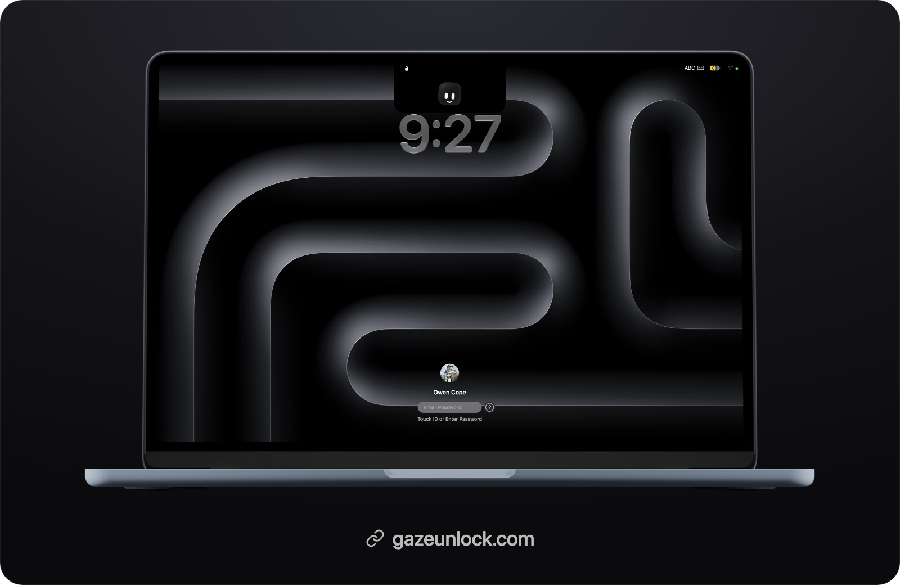
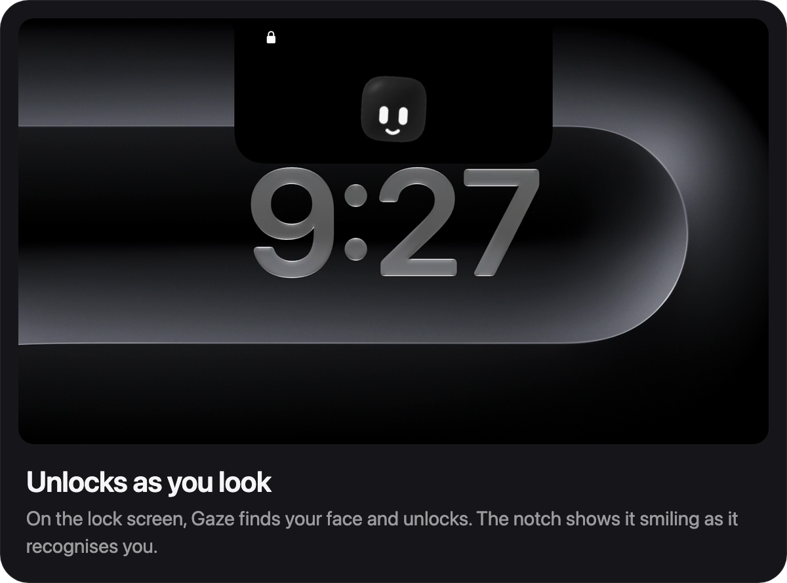
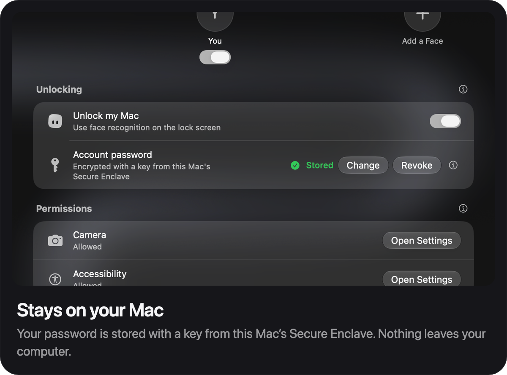
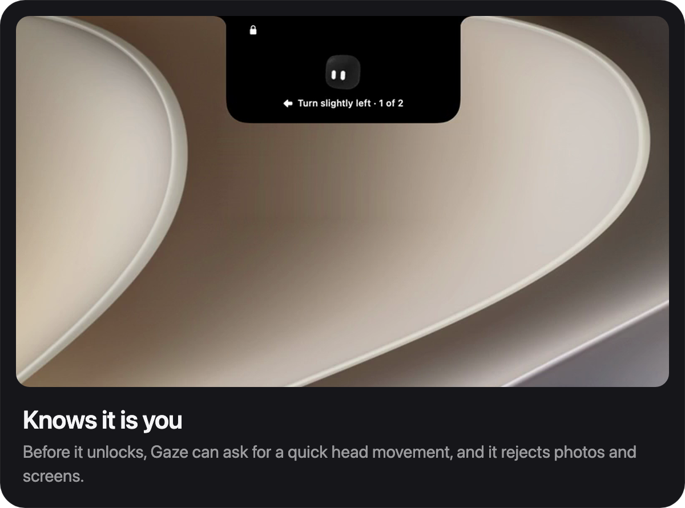
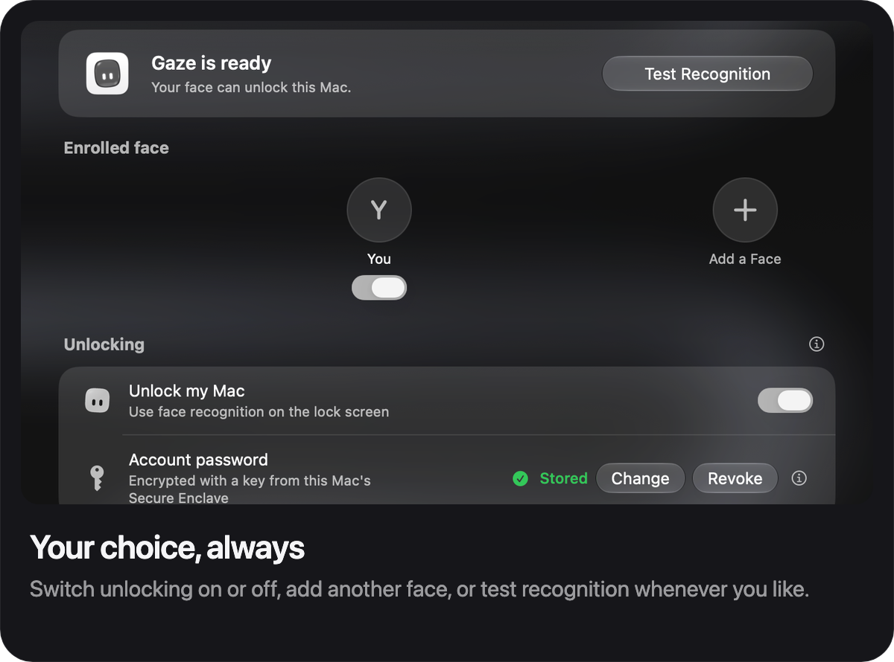

<div align="center">
  
  <h1>Gaze</h1>
  <p>Gaze is an app that brings the Face ID feature of your iPhone to your Mac.</p>
  <p>Look at your Mac to unlock it. Private, on-device, and free.</p>
  <p>
    <a href="https://gazeunlock.com"></a>
    <a href="https://www.swift.org"></a>
    <a href="LICENSE"></a>
    <a href="https://gazeunlock.com"></a>
  </p>
</div>

<p align="center">
  <a href="https://gazeunlock.com"></a>
</p>

<p align="center">
  <a href="https://gazeunlock.com"></a>
</p>

## Features

Face ID for Mac, with nothing leaving your computer.

<p align="center">
  
  
  
  
</p>

## Simple to install.

Install with Homebrew, and it opens without any warning.

```sh
brew install --cask owencope/gaze/gaze
```

Or download it from [gazeunlock.com](https://gazeunlock.com) and drag Gaze to Applications. The first time you open it, go to System Settings, then Privacy & Security, and click Open Anyway.

## Unlocks as you look.

When your Mac locks, Gaze turns on the camera and looks for you. It compares your face with the one you set up, may ask you to turn your head, then enters your password and unlocks. If anything doesn’t match, you sign in as usual.

## Private by design.

Recognition runs on your Mac and nothing is uploaded. Your face data is encrypted, and your password is protected by a key from the Secure Enclave. A Mac camera can’t measure depth like Face ID, so Gaze rejects photos and screens, and your password always works. To report a security issue, see [SECURITY.md](SECURITY.md).

## What you need.

A Mac with macOS 26 Tahoe or later, a built-in or connected camera, and your login password.

## Open source.

Gaze is built in the open. You’ll need Xcode 26 to build it.

```sh
git clone https://github.com/OwenCope/Gaze.git
cd Gaze
./build.sh
open build/Gaze.app
```

Source archives don’t include the recognition model; [NOTICE.md](NOTICE.md) explains why. Pull requests are welcome. Start with [CONTRIBUTING.md](CONTRIBUTING.md) and the [code of conduct](CODE_OF_CONDUCT.md).

## Thanks.

Gaze wouldn’t exist without [Harsh Vardhan Goswami](https://github.com/theboringhumane), creator of TheBoringNotch, whose GPT-6 Astra API key powered much of its development.

It also builds on [InsightFace](https://github.com/deepinsight/insightface) for recognition, [Sapphire](https://sapphire-app.tech) for the Core ML model, [TourKit](https://github.com/rampatra/TourKit) for the welcome tour, [Atoll](https://github.com/Ebullioscopic/Atoll) and [SkyLightWindow](https://github.com/Lakr233/SkyLightWindow) for the lock-screen panel, and the [Face Spoof Detection](https://universe.roboflow.com/mohammeds-workspace-ft3sn/face-spoof-detection-liika) dataset. [Glance](https://github.com/jonnyoo/glance) and [DynamicLake](https://dynamiclake.com) inspired its design.

<sub>Available under the [MIT license](LICENSE). Some models, code and data have their own terms, listed in [NOTICE.md](NOTICE.md). Gaze is not affiliated with Apple. Face ID, iPhone and Mac are trademarks of Apple Inc.</sub>
